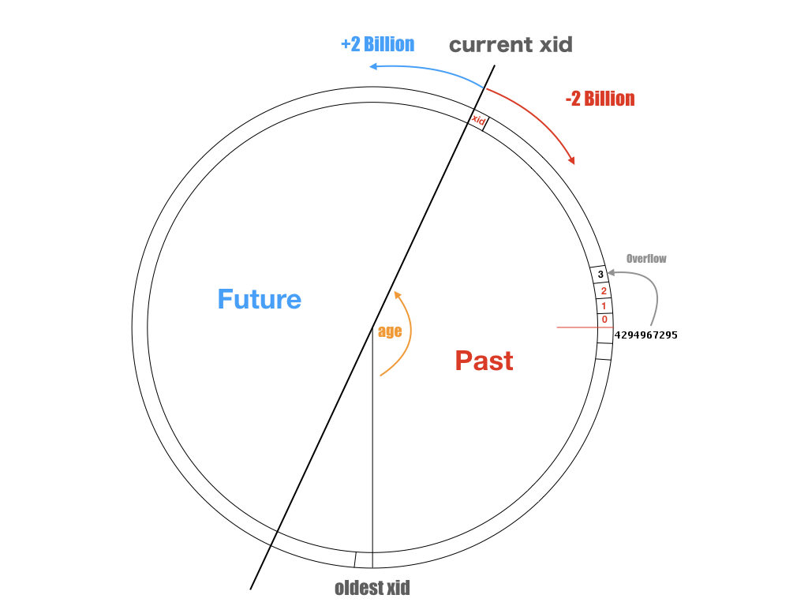

# PostgreSQL事务回卷故障

遇到一次磁盘坏块导致的事务回卷故障：

* 主库（PostgreSQL 9.3）磁盘坏块导致几张表上的VACUUM FREEZE执行失败。
* 无法回收老旧事务ID，导致整库事务ID濒临用尽，数据库进入自我保护状态不可用。
* 磁盘坏块导致手工VACUUM抢救不可行。
* 提升从库后，需要紧急VACUUM FREEZE才能继续服务，进一步延长了故障时间。
* 主库进入保护状态后提交日志（clog）没有及时复制到从库，从库产生存疑事务拒绝服务。


## 背景

PostgreSQL实现了**快照隔离（Snapshot Isolation）**，每个事务开始时都能获取数据库在该时刻的快照（也就是只能看到**过去**事务提交的结果，看不见**后续**事务提交的结果）。这一强大的功能是通过MVCC实现的，但也引入了额外复杂度，例如**事务ID回卷**问题。

事务ID（`xid`）是用于标识事务的**32位无符号整型数值**，递增分配，其中值0,1,2为保留值，溢出后回卷为3重新开始。**事务ID之间的大小关系决定了事务的先后顺序**。

```c
/*
 * TransactionIdPrecedes --- is id1 logically < id2?
 */
bool
TransactionIdPrecedes(TransactionId id1, TransactionId id2)
{
	/*
	 * If either ID is a permanent XID then we can just do unsigned
	 * comparison.  If both are normal, do a modulo-2^32 comparison.
	 */
	int32		diff;

	if (!TransactionIdIsNormal(id1) || !TransactionIdIsNormal(id2))
		return (id1 < id2);

	diff = (int32) (id1 - id2);
	return (diff < 0);
}
```




​	可以将`xid`的取值域视为一个整数环，但刨除`0,1,2`三个特殊值。0代表无效事务ID，1代表系统事务ID，2代表冻结事务ID。特殊的事务ID比任何普通事务ID小。而普通事务ID之间的比较可参见上图：它取决于两个事务ID的差值是否超出`INT32_MAX`。对任意一个事务ID，都有约21亿个位于过去的事务和21亿个位于未来的事务。

​	xid不仅仅存在于活跃的事务上，xid会影响所有的元组：事务会给自己影响的元组打上自己的xid作为记号。每个元组都会用`(xmin, xmax)`来标识自己的可见性，`xmin` 记录了最后写入（`INSERT`, `UPDATE`）该元组的事务ID，而`xmax`记录了删除或锁定该元组的事务ID。每个事务只能看见由先前事务提交（`xmin < xid`）且未被删除的元组（从而实现快照隔离）。

​	如果一个元组是由很久很久以前的事务产生的，那么在数据库的例行VACUUM FREEZE时，会找出当前活跃事务中最老的xid，将所有`xmin < xid`的元组的`xmin`标记为`2`，也就是冻结事务ID。这意味着这条元组跳出了这个比较环，比所有普通事务ID都要小，所以能被所有的事务看到。通过清理，数据库中最老的xid会不断追赶当前的xid，从而避免事务回卷。

​	数据库或表的**年龄（age）**，定义为当前事务ID与数据库/表中存在最老的`xid`之差。最老的`xid`可能来自一个持续了几天的超长事务。也可能来自几天前老事务写入，但尚未被冻结的元组中。如果数据库的年龄超过了`INT32_MAX`，灾难性情况就发生了。过去的事务变成了未来的事务，过去事务写入的元组将变得不可见。

​	为了避免这种情况，需要避免**超长事务**与定期VACUUM FREEZE冻结老元组。如果单库在平均3万TPS的超高负载下，20亿个事务号一整天内就会用完。在这样的库上就无法执行一个超过一天的超长事务。而如果由于某种原因，自动清理工作无法继续进行，一天之内就可能遇到事务回卷。

​	9.4之后对FREEZE的机制进行了修改，FREEZE使用元组中单独的标记位来表示。

​	PostgreSQL应对事务回卷有自我保护机制。当临界事务号还剩一千万时，会进入紧急状态。


## 查询

查询当前所有表的年龄，SQL 语句如下：

```sql
SELECT c.oid::regclass as table_name,
     greatest(age(c.relfrozenxid),age(t.relfrozenxid)) as age
FROM pg_class c
LEFT JOIN pg_class t ON c.reltoastrelid = t.oid
WHERE c.relkind IN ('r', 'm') order by 2 desc;
```

查询数据库的年龄，SQL语句如下：

```sql
SELECT *, age(datfrozenxid) FROM pg_database; 
```


#### 清理

执行`VACUUM FREEZE`可以冻结老旧事务的ID

```sql'
set vacuum_cost_limit = 10000;
set vacuum_cost_delay = 0;

VACUUM FREEZE VERBOSE;
```

可以针对特定的表进行VACUUM FREEZE，抓主要矛盾。


## 问题

通常来说，PostgreSQL的AutoVacuum机制会自动执行FREEZE操作，冻结老旧事务的ID，从而降低数据库的年龄。因此一旦出现事务ID回卷故障，通常祸不单行，意味着vacuum机制可能被其他的故障挡住了。

目前遇到过三种触发事务ID回卷故障的情况


### IDLE IN TRANSACTION

空闲事务会阻塞VACUUM FREEZE老旧元组。

解决方法很简单，干掉IDEL IN TRANSACTION的长事务然后执行VACUUM FREEZE即可。


### 存疑事务

clog损坏，或没有复制到从库，会导致相关表进入事务存疑状态，拒绝服务。

需要手工拷贝，或使用dd生成虚拟的clog来强行逃生。


### 磁盘/内存坏块

因为坏块导致的无法VACUUM比较尴尬。

需要通过二分法定位并跳过脏数据，或者干脆直接抢救从库。


### 注意事项

紧急抢救的时候，不要整库来，按照年龄大小降序挨个清理表会更快。

注意当主库进入事务回卷保护状态时，从库也会面临同样的问题。


## 解决方案

### AutoVacuum参数配置

### 年龄监控

[未完待续]

