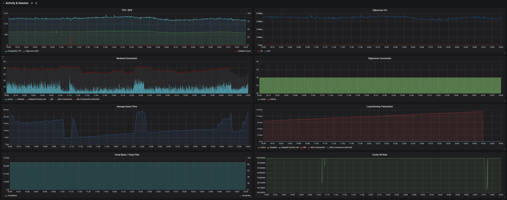
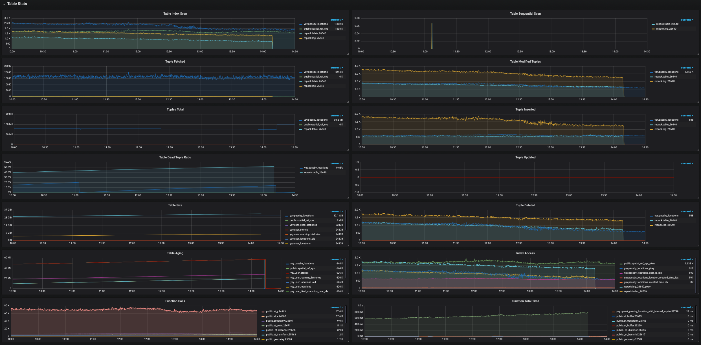
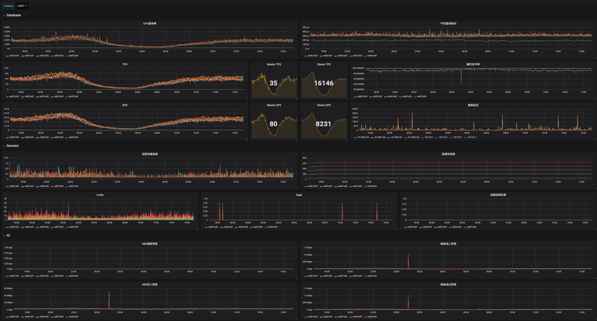
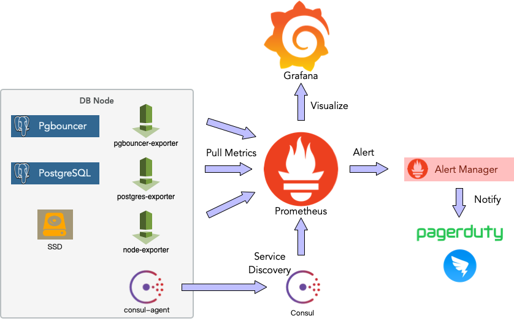

# PostgreSQL监控系统概览

PostgreSQL是一个很棒的数据库，但也相当复杂。上手虽简单，但想要用好不容易，想要管理好就更麻烦了。监控系统是几乎所有运维工作的基础，更亦是驾驭数据库的必备工具。用好一个监控系统，理解各种指标背后的意义并不是一件简单的事情。

## 0x01 PostgreSQL监控面板

为了帮助读者形成一种直觉，这里展示了在实际环境中所使用的监控面板。最为常用的监控面板为“单数据库实例”监控，并分为7个主要的子区域：概览，操作系统，数据库活动与会话，复制，检查点与WAL，数据库冲突，以及数据库对象统计，如下所示。

## 监控系统的架构

程序员的一个基本原则就是：“不要造轮子”。所以如果有现成的开源组件能用，那是最好不过。一个比较简单的实用监控系统架构如下图所示。主要组件包括：Prometheus，Grafana，Consul，以及各个Exporter。各类Exporter从数据库，连接池，以及机器上获取指标数据库，Prometheus从Consul中发现这些Exporter，并向其拉取数据，Grafana负责展示Prometheus中的数据，而AlertManager负责报警相关的任务。

## 监控系统的指标

监控面板与系统架构，不过是监控系统的面子，真正的里子在于监控指标。哪些指标需要监控，每种指标如何解读，这才是真正重要的东西。毕竟知道了这些知识，即使没有监控系统，通过命令行手工检查也可以发现问题，但不了解指标背后的涵义，即使再傻瓜再漂亮的监控面板也于事无补。

下面会简单介绍单实例监控面板中涉及到的指标。

### 概览

概览是一些重要的核心指标，一眼扫过去就应当能大致定位数据库的主要问题。这里主要包括：

* CPU使用率、平均查询时间、TPS、QPS，连接池排队数，活跃连接数：判断数据库负载水平
* 内存空闲率：判断是否出现进程异常（例如突然被杀）
* 磁盘空闲率：判断磁盘是否被写满
* 数据库年龄：数据库是否快出现事务标识回卷故障。
* 数据库大小，缓存命中率：判断异常活动

### 操作系统指标

操作系统指标主要包括：

* CPU与负载水平
* 内存使用，特别需要关注操作系统`cache`部分的变化。
* 网络与磁盘的IO吞吐量，磁盘的IOPS。

操作系统的指标能直观地反映大部分数据库活动异常，对于硬件类故障的排查尤有帮助。

### 数据库活动与会话

Activity与Session是数据库当前状态的直观反映，指标包括：

* TPS/QPS，平均响应时间都是最直接的负载指标。
* 缓存命中率对数据库性能有直接的影响，注意这里只是PostgreSQL本身BufferPool的命中率，并没有计算操作系统的文件缓存。
* 后端连接按状态的分布，`active`状态的连接是很重要的负载指标，而`idle in transaction`的连接数则需要特别关注。
* 临时文件通常是由一些复杂查询，长查询，过多的临时文件容易导致性能恶化。

### 复制指标

很多类型的故障与主从复制滞后有关，因此，ReplicationDelay是一个重要的监控指标。

在主库上可以获取从库的复制延迟，包括LSN落后的字节数，以及滞后的时长（v10以后）。在从库上也可以获得距离主库的滞后时长，但这种方法通常不如前一种准确。

### 检查点与WAL

检查点会吃IO，一方面它会引发大量页面落盘，另一方面在默认`full_page_write`打开的情况下，每一次检查点都会导致其后的WAL量升高，吃磁盘与网络的带宽。在一些情况下可能会成为故障的原因。因此有必要监控检查点与WAL，相关指标包括：

* WAL日志的生成速率
* LSN增长的速度
* 缓冲区刷回的数目，通常缓冲区刷回主要由Checkpoint负责，如果有大量缓冲区由后端进程负责刷盘，就需要检查并调整相关参数的配置了。
* 数据库与WAL日志的大小。

### 锁与数据库冲突

锁按类型分布的数据对于判断数据库活动的类型很有帮助。

### 对象级统计

对象级统计能够帮助DBA快速定位故障的根源。包括：

* 每个表的访问次数：索引扫描/顺序扫描。频繁出现的顺序扫描往往意味着索引出现了问题。
* 表中元组的拉取，修改，增删改查数目，表的大小，年龄，都有助于精确定位问题的来源。
* 死元组的比例：死元组的比例可用于估算表的膨胀程度，对于维持性能很有帮助。（还有另外一种通过统计数据估算表膨胀率的方法）
* 函数的调用次数与执行时间。

## 监控指标的来源

### 统计收集器

对于PostgreSQL而言，其监控指标主要源于自带的统计收集器。PostgreSQL提供了很多系统视图，因此能很简单地以SQL语句的形式拉取统计数据。系统视图的具体定义可以参考文档，后续文章也会依此详细介绍。其中，比较重要的视图包括：

| 视图名称                     | 描述                                                       |
| ---------------------------- | ---------------------------------------------------------- |
| `pg_stat_bgwriter`           | 只有一行，后台写入器相关统计信息                           |
| `pg_stat_activity`           | 可以看到数据库中的活动，非常重要                           |
| `pg_stat_statement`          | 可以统计数据库中每条查询的执行情况，很重要但不太适合展现。 |
| `pg_stat_database`           | 每个数据库一行，显示数据库范围的统计信息。                 |
| `pg_stat_database_conflicts` | 每个数据库一行，显示了数据库中的各类冲突数目。             |
| `pg_stat_user_tables`        | 包含了每个表的详细统计信息                                 |
| `pg_stat_user_indexes`       | 包含了每个索引上详细的统计信息                             |
| `pg_statio_user_tables`      | 包含了表上IO花费的时间，但因为计时会影响性能，打开需小心。 |
| `pg_stat_user_functions`     | 包含了函数的调用总次数，执行时长等统计信息                 |
| `pg_stat_replication`        | 每一条对应一个slave（LSN消费者），包含了复制相关的指标。   |
| `pg_stat_wal_receiver`       | 在从库上可以从这里看到主库相关的信息                       |

从统计视图中收集数据有一些注意事项：

- 统计数据并非实时更新的，每个服务进程只有在闲置前会更新统计计数。所以正在执行的查询和事务不影响计数。
- 收集器本身每隔（`PGSTAT_STAT_INTERVAL=500ms`）才发送一次新的报告。所以除了 当前进程活动`track_activity`之外的统计指标都不是最新的。
- 在事务中执行的统计查询，统计数据不会发生变化。使用`pg_stat_clear_snapshot()`来获取最新的快照。

* 要让数据库收集这些统计数据，需要在`postgresql.conf`中打开各种`track_*`选项。

### 系统视图

除了统计视图外，还有一些系统视图也能提供很多有价值的指标信息，例如`pg_database`与`pg_locks`，分别提供了数据库年龄尺寸，以及数据库内的锁等待信息。此外，还有很多系统指标是通过内建的函数提供的。

## 结语

监控是一个很大的话题，够写半本书了，因此这篇文章能做的也就是给读者留下一点直觉：监控系统应该是啥样子的。其实这玩意很简单，有了以上的信息，一个合格的架构师与PostgreSQL DBA应该能很轻松的复现该监控系统了。具体的实现细节，将在后续文章中继续介绍。