# Pigsty Overview


> Pigsty is an advanced PostgreSQL monitoring systemd based on open source projects like prometheus & grafana. PIGSTY /pɪɡ staɪ/ is the abbreviation of "Postgres in Grafana Style".
>

Pigsty是一个基于Grafana与Prometheus与Consul的Postgres监管系统


## 整体架构

> TLDR: (Node/Pg/Pgbouncer) Exporter Discovered by Consul to Prometheus to Grafana

```
┏━━━━━━━━━━━┓     ┏━━━━━━━━━━━━━━━━━━━━┓ 
┃   Node    ┃ --> ┃   Node    Exporter-┃┐
┃ Pgbouncer ┃ --> ┃ Pgbouncer Exporter-┃┼--> Prometheus ---> Grafana 
┃ Postgres  ┃ --> ┃ Postgres  Exporter-┃┘        ↑
┃           ┃     ┗━━━━━━━━━━━━━━━━━━━━┛  (Service Discovery)
┃  Consul   ┃ ----------------------------->   Consul
┗━━━━━━━━━━━┛   

```

### 层次组织

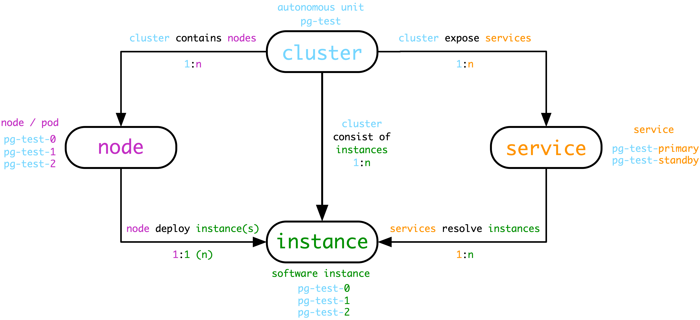

监控主要分为五个层次，集群（cluster），服务（service），实例（instance），数据库（database），与节点（node）。不过在本系统中，服务层次的监控指标被整合至集群级别，数据库层次的监控指标被整合至实例级别。因此实际上，只有三个层次的监控展示：集群，实例，节点。

* 集群使用`cls`唯一标识，名称类似于：`pg-test-tt`
* 实例使用`ins`唯一标识，名称类似于：`pg-test-tt-0`， 以集群为前缀，序号为后缀。后缀为0的实例通常是集群中的主库。
* 节点使用`ip`唯一标识。

除此之外，还有一些其他层次的Dashboard：例如全局大盘Overview，分片库专用的Shard Dashboard，曾经存在过的Database、Pool层次的Dashboard：

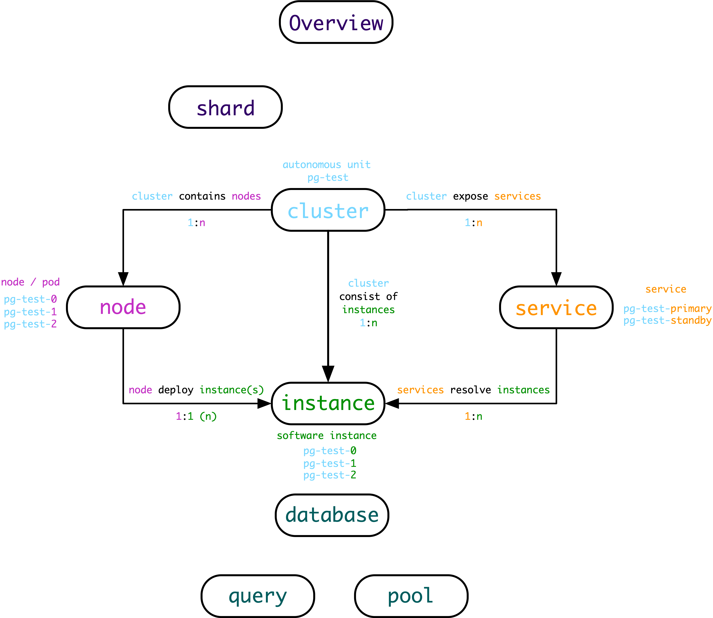

## 功能简介

核心功能：日常巡检，故障排查，性能优化，全知即全能。

* PG全局监控
* PG Shard监控
* PG集群监控
* PG实例监控
* PG实例监控（故障排查专用视图）
* PG节点监控
* PG慢查询平台
* Redis全局概览
* Redis集群监控
* Redis实例监控
* PG集群健康度评估系统


一个简单的故障分析案例：[PaymentDB从库慢查询雪崩](https://dba.p1staff.com/d/pg-query/pg-query?orgId=1&var-ins=pg-payment-tt-1&var-datname=putong-payment&var-query=2135801846&var-seq=1&var-cls=pg-payment-tt&var-role=standby&var-ip=10.189.11.22&var-node=11.slave.paymentdb1.tt.bjs.p1staff.com&from=1590400130793&to=1590408640477)

一个简单的性能优化案例：[Followshipshard慢查询优化](https://dba.p1staff.com/d/pg-query/pg-query?orgId=1&var-ins=pg-followshipshard2-tt-1&var-datname=putong-followship-shard&var-query=2948990270&from=1589857472572&to=1590029998721)


## 监控介绍：[DB监控首页](https://dba.p1staff.com/d/home)

包含PG和Redis两部分，左侧为全局指标概览，右侧为集群导航。中间为全局报警与事件提醒。

点击右上角的导航链接，或者页面中的可导航元素（Shard，集群名，实例名，IP等）可跳转至感兴趣的面板

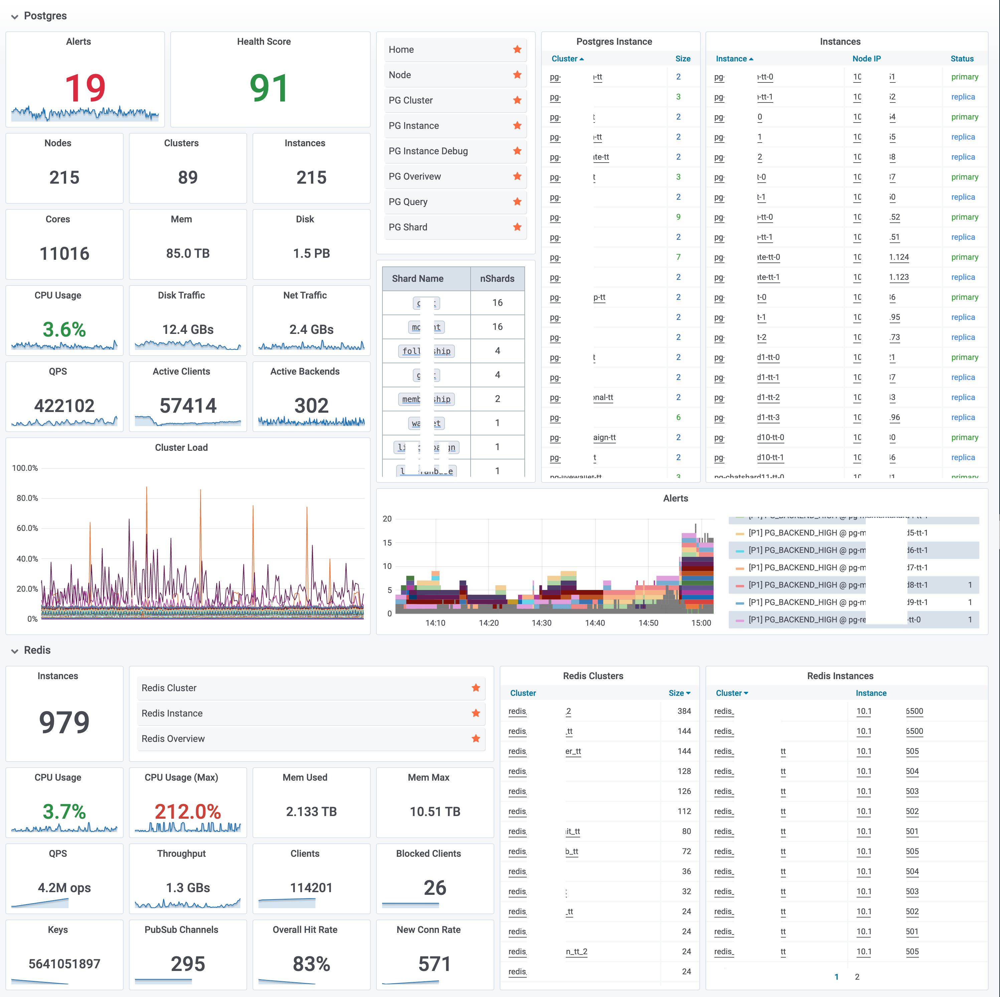


## DB监控：指标介绍

### 指标丰富程度

> 你可以不看，我不能没有。

每个实例包括了约3300个指标，其中：

**数据库与连接池指标1000个，其中规则定义衍生指标250个**。

**节点指标约2000个，其中规则定义的衍生指标700个**。


### 指标内容

四大类黄金指标：

* 错误

  * 配置错误：关键功能是否配置正常：校验和，Numa，透明大页，同步提交等。
  * 内存错误，TCP错误，时间漂移错误
  * 服务宕机：机器，数据库，连接池，监控组件
  * 数据库客户端排队，IdleInXact连接，超长事务，死锁，复制中断，大量回滚，监控报错

* 饱和度

  * **PG Load**, Node Load

  * CPU使用，内存使用，磁盘使用，缓存命中率，后端连接使用，连接池使用

* 流量

  * 数据库直接指标：QPS，TPS，查询细分QPS
  * 间接流量指标：连接池进出流量，WAL写入量，增删改查条数，块访问量，缓冲区访问量
  * 节点流量：磁盘IO流量，网络IO流量，内存页面换入换出

* 延迟

  * 事务平均响应时间 Xact RT
  * 查询平均响应时间 Query RT
  * 语句平均响应时间： Statement RT
  * 磁盘平均响应时间：Disk R/W Latency
  * 复制延迟（以秒或字节计算）
  * 监控查询延迟


## DB监控：PG实例

### 实例概览

* 实例身份信息：集群名，ID，所属节点，软件版本，所属集群其他成员等
* 实例配置信息：一些关键配置，目录，端口，配置路径等
* 实例健康信息，实例角色（Primary，Standby）等。
* 黄金指标：PG Load，复制延迟，活跃后端，排队连接，查询延迟，TPS，数据库年龄
* 数据库负载：实时（Load0），1分钟，5分钟，15分钟
* 数据库警报与提醒事件

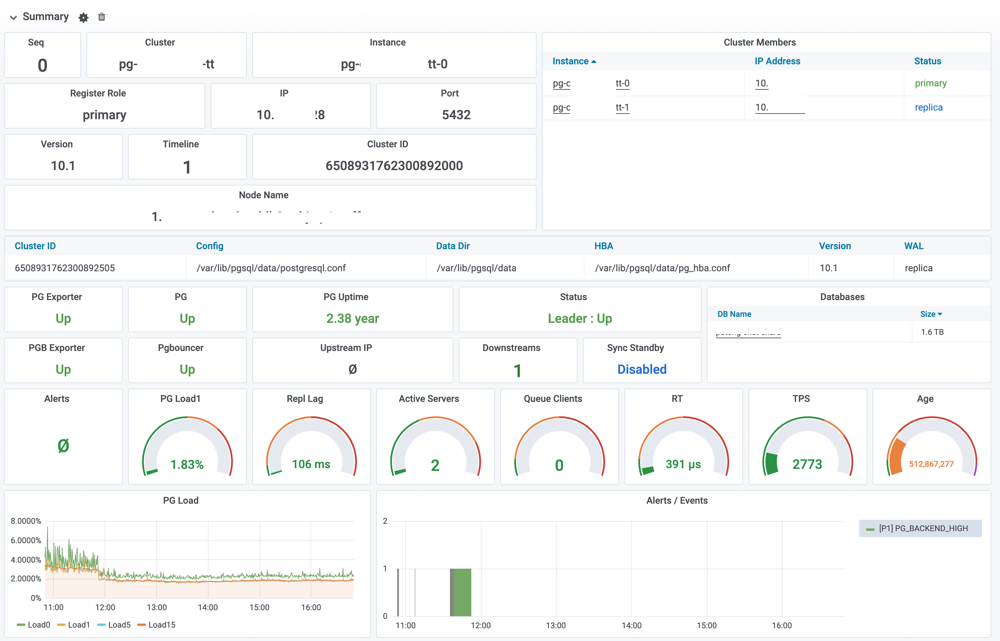

#### 关于PG Load的一些事

[用于性能评估的黄金指标：PG Load](metric-pg-load.md)

### 节点概览

* 四大基本资源：CPU，内存，磁盘，网卡的配置规格，关键功能，与核心指标
* 右侧是网卡详情与磁盘详情

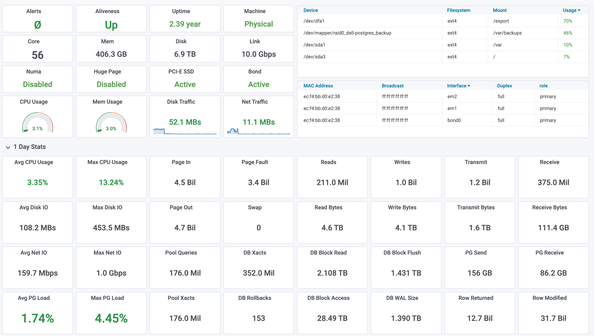

#### 单日统计

以最近1日为周期的统计信息（从当前时刻算起的前24小时），比如最近一天的查询总数，返回的记录总数等。上面两行是节点级别的统计，下面两行是主要是PG相关的统计指标。

对于计量计费，水位评估特别有用。


#### 复制

* 当前节点的Replication配置

* 复制延迟：以秒计，以字节计的复制延迟，复制槽堆积量
* 下游节点对应的Walsender统计
* 各种LSN进度，综合展示集群的复制状况与持久化状态。
* 下游节点数量统计，可以看出复制中断的问题

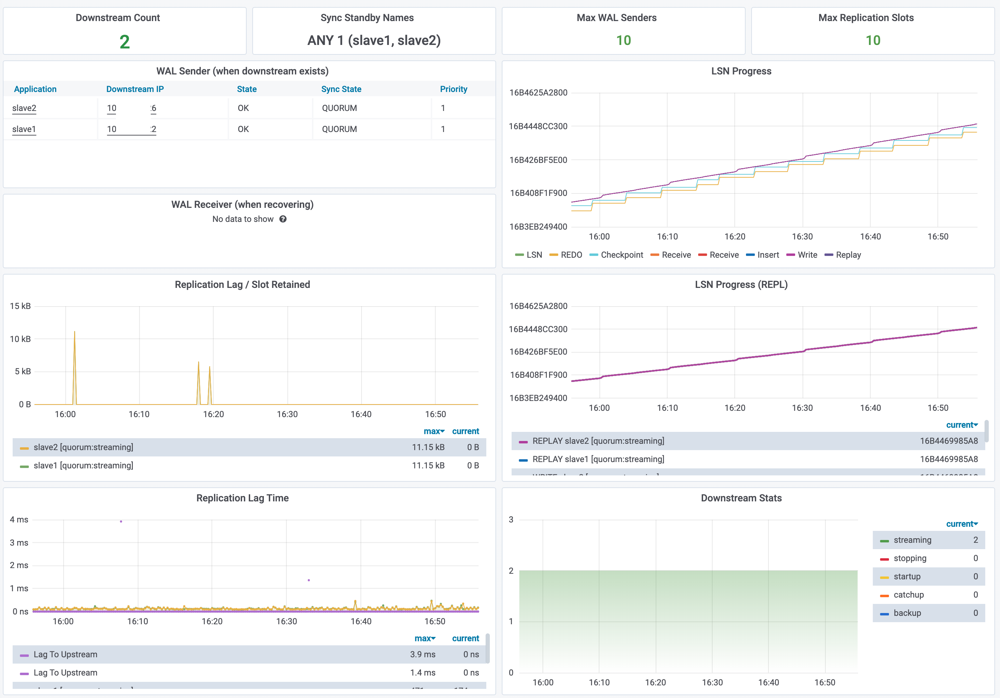

#### 事务

事务部分用于洞悉实例中的活动情况，包括TPS，响应时间，锁等。

* TPS概览信息：TPS，TPS与过去两天的DoD环比。DB事务数与回滚数
* 回滚事务数量与回滚率
* TPS详情：绿色条带为±1σ，黄色条带为±3σ，以过去30分钟作为计算标准，通常超出黄色条带可认为TPS波动过大
* Xact RT，事务平均响应时间，从连接池抓取。绿色条带为±1σ，黄色条带为±3σ。
* TPS与RT的偏离程度，是一个无量纲的可横向比较的值，越大表示指标抖动越厉害。$(μ/σ)^2$
* 按照DB细分的TPS与事务响应时间，通常一个实例只有一个DB，但少量实例有多个DB。
* 事务数，回滚数（TPS来自连接池，而这两个指标直接来自DB本身）

* 锁的数量，按模式聚合（8种表锁），按大类聚合（读锁，写锁，排他锁）


#### 查询

大多数指标与事务中的指标类似，不过统计单位从事务变成了查询语句。查询部分可用于分析实例上的慢查询，定位性能瓶颈。

* QPS 每秒查询数，与Query RT查询平均响应时间，以及这两者的波动程度，QPS的周期环比等
* 生产环境对查询平均响应时间有要求：1ms为黄线，100ms为红线

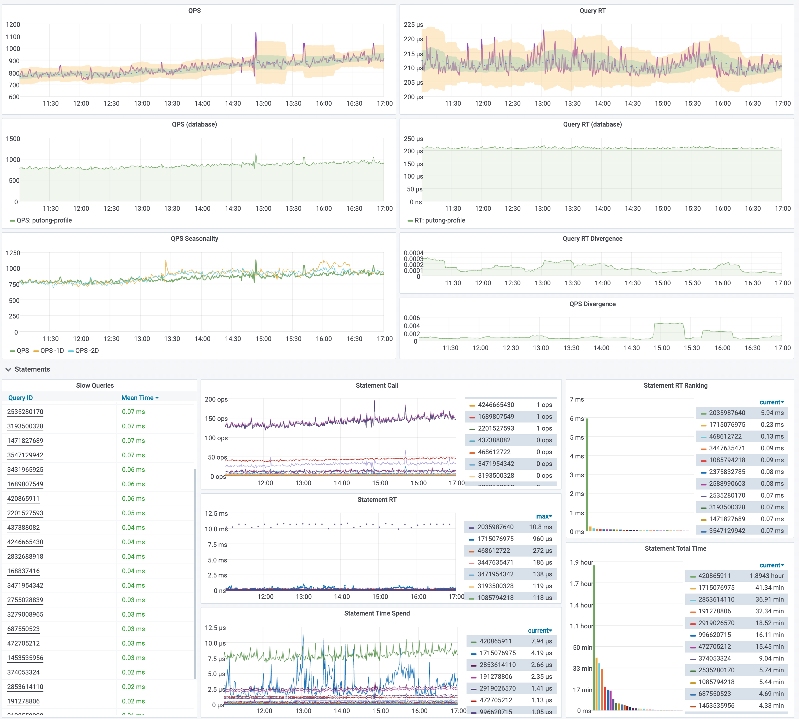

#### 语句

语句展示了查询中按语句细分的指标。每条语句（查询语法树抽离常量变量后如果一致，则算同一条查询）都会有一个查询ID，可以在慢查询平台中获取到具体的语句与详细指标与统计。

* 左侧慢查询列表是按`pg_stat_statments`中的平均响应时间从大到小排序的，点击查询ID会自动跳转到慢查询平台
* 这里列出的查询，是累计查询耗时最长的32个查询，但排除只有零星调用的长耗时单次查询与监控查询。
* 右侧包括了每个查询的实时QPS，平均响应时间。按照RT与总耗时的排名。

#### 后端进程

后端进程用于显示与PG本身的连接，后端进程相关的统计指标。特别是按照各种维度进行聚合的结果，特别适合定位雪崩，慢查询，其他疑难杂症。 

* 后端进程数按种类聚合，后端进程按状态聚合，后端进程按DB聚合，后端进程按等待事件类型聚合。
* 活跃状态的进程/连接，在事务中空闲的连接，长事务。

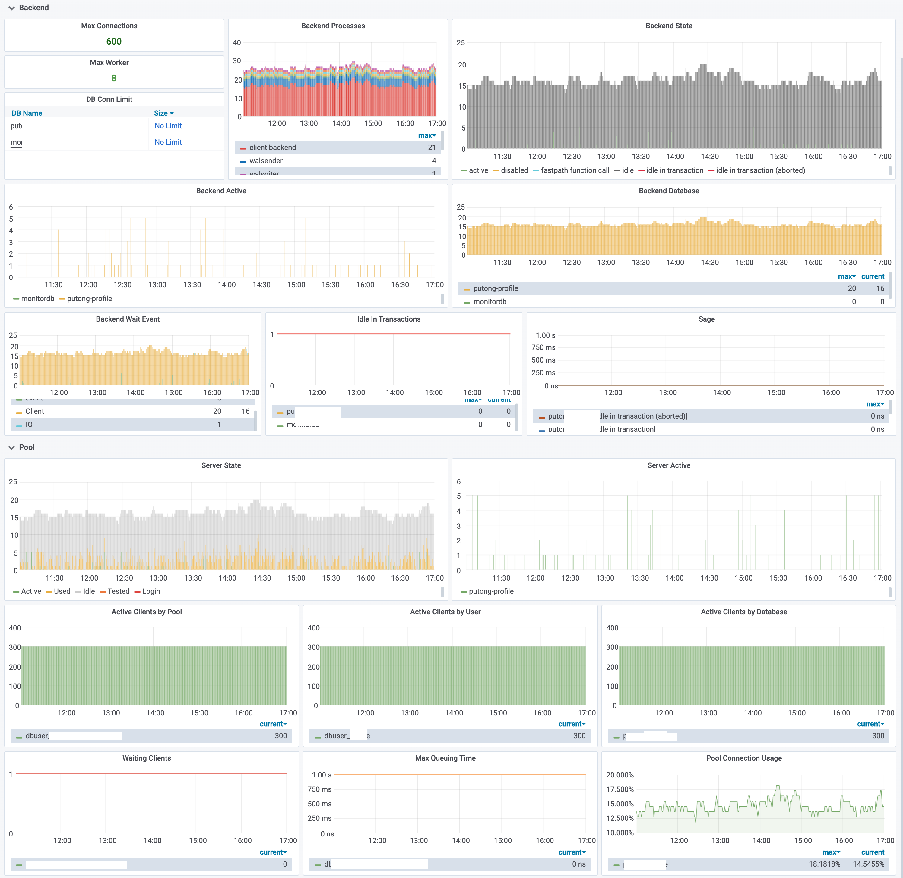

#### 连接池

连接池部分与后端进程部分类似，但全都是从Pgbouncer中间件上获取的监控指标

* 连接池后端连接的状态：活跃，刚用过，空闲，测试过，登录状态。
* 分别按照User，按照DB，按照Pool（User:DB）聚合的前端连接，用于排查异常连接问题。
* **等待客户端数（重要）**，以及队首客户端等待的时长，用于定位连接堆积问题。
* 连接池可用连接使用比例。

#### 数据库概览

Database部分主要来自`pg_stat_database`与`pg_database`，包含数据库相关的指标：

* WAL Rate，标识数据库的写入负载，每秒产生的WAL字节数量。
* Buffer Hit Rate，数据库 ShareBuffer 命中率，未命中的页面将从操作系统PageCache和磁盘获取。
* 每秒增删改查的记录条数
* 临时文件数量与临时文件大小，可以定位大型查询问题。

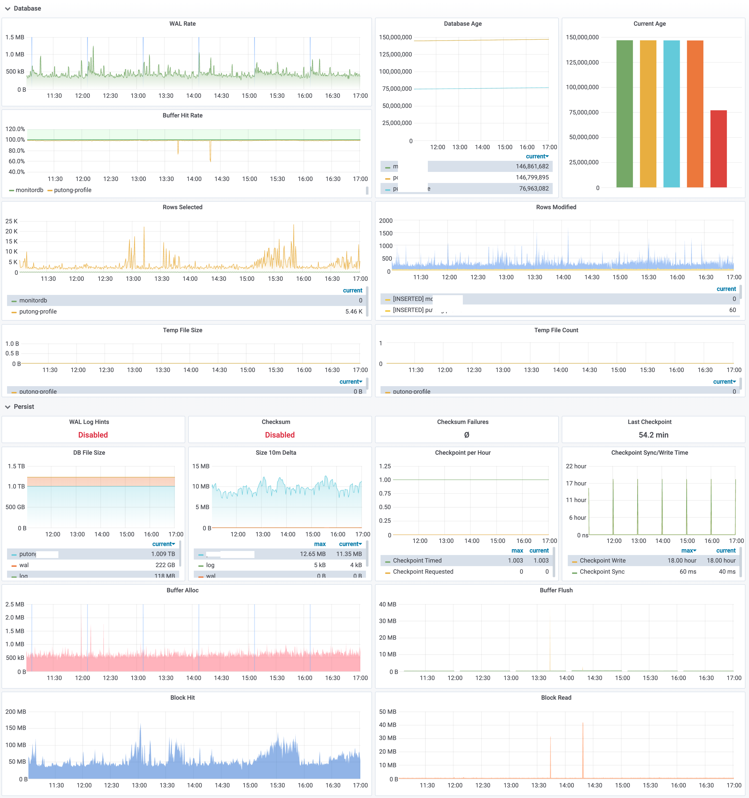

#### 持久化

持久化主要包含数据落盘，Checkpoint，块访问相关的指标

* 重要的持久化参数，比如是否出现数据校验和验证失败（如果启用可以检测到数据腐坏）
* 数据库文件（DB，WAL，Log）的大小与增速。
* 检查点的数量与检查点耗时。
* 每秒分配的块，与每秒刷盘的块。每秒访问的块，以及每秒从磁盘中读取的块。（以字节计，注意一个Buffer Page是8192，一个Disk Block是4096）

#### 监控Exporter

Exporter展示了监控系统组件本身的监控指标，包括：

* Exporter是否存活，Uptime，Exporter每分钟被抓取的次数
* 每个监控查询的耗时，产生的指标数量与错误数量。

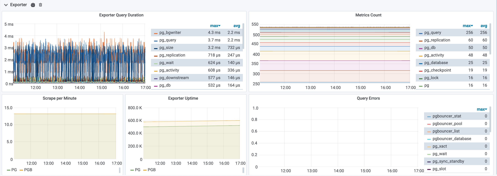


## DB监控：PG集群

PG集群监控是最常用的Dashboard，因为PG以集群为单位提供服务，因此Cluster集合了最完整全面的信息。

大多数监控图都是实例级监控的泛化与上卷，即从展示单个实例内的细节，变为展现集群内每个实例的信息，以及集群和服务层次聚合后的指标。

### 集群概览

Cluster级别的集群概览相比实例级别多了一些东西：

* 时间线与领导权，当数据库发生Failover或Switchover时，时间线会步进，领导权会发生变化。
* 集群拓扑，集群拓扑展现了集群中的复制拓扑，以及采用的复制方式（同步/异步）。
* 集群负载，包括整个集群实时、1分钟、5分钟、15分钟的负载情况。以及集群中每个节点的Load1
* 集群报警与事件。

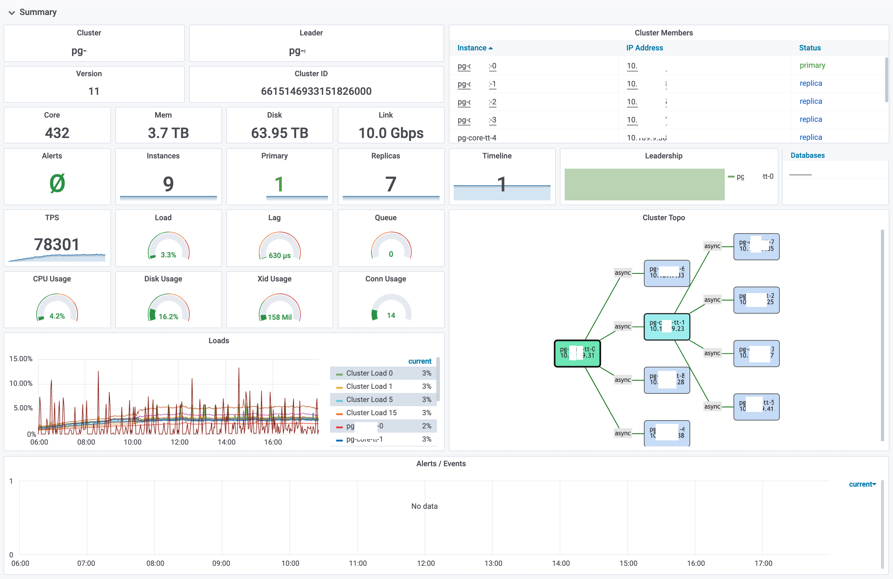


### 集群复制

Cluster级别的Dashboard与Instance级别Dashboard最重要的区别之一就是提供了整个集群的复制全景。包括：

* 集群中的主库与级联桥接库。集群是否启用同步提交，同步从库名称。桥接库与级联库数量，最大从库配置

* 成对出现的Walsender与Walreceiver列表，体现一对主从关系的复制状态
* 以秒和字节衡量的复制延迟（通常1秒的复制延迟对应10M~100M不等的字节延迟），复制槽堆积量。
* 从库视角的复制延迟
* 集群中从库的数量，备份或拉取从库时可以从这里看到异常。
* 集群的LSN进度，用于整体展示集群的复制状态与持久化状态。

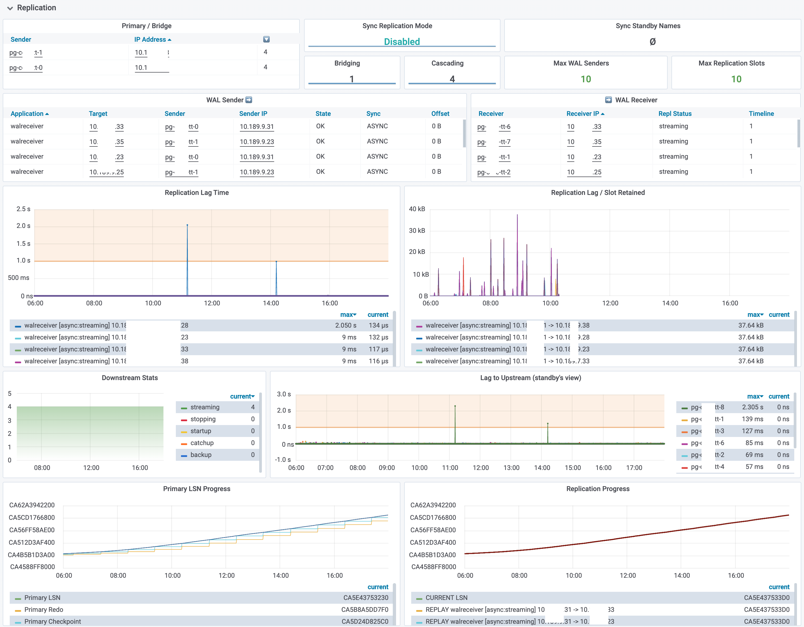


### 节点指标

PG机器的相关指标，按照集群进行聚合。

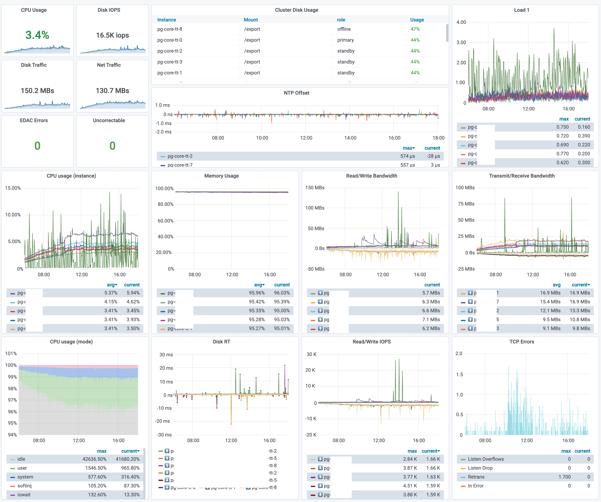


### 事务与查询

与实例级别的类似，但添加了Service层次的聚合（一个集群通常提供`primary`与`standby`两种Service）。

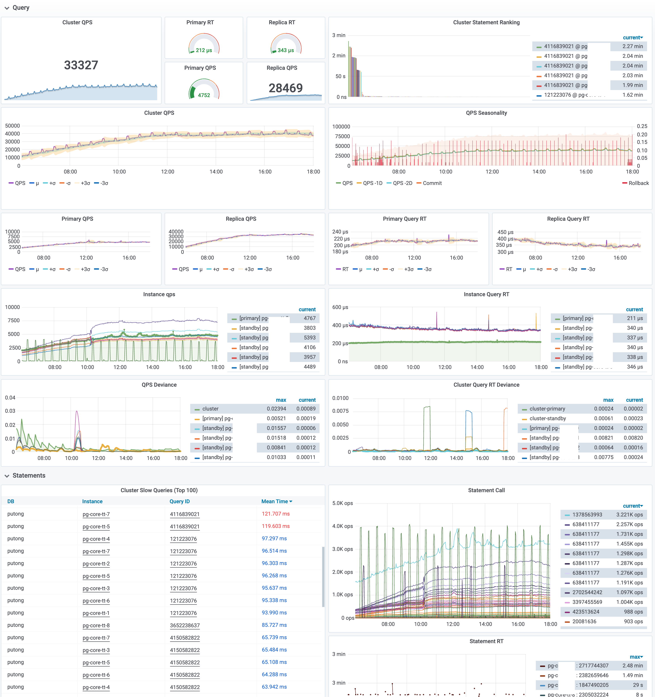

其他指标与实例级别差别不大。


## DB监控：PG总览

## DB监控：PG慢查询平台

显示慢查询相关的指标，上方是本实例的查询总览。鼠标悬停查询ID可以看到查询语句，点击查询ID会跳转到对应的查询细分指标页（Query Detail）。

* 左侧是格式化后的查询语句，右侧是查询的主要指标，包括
  * 每秒查询数量：QPS
  * 实时的平均响应时间（RT Realtime）
  * 每次查询平均返回的行数
  * 每次查询平均用于BlockIO的时长
  * 响应时间的均值，标准差，最小值，最大值（自从上一次统计周期以来）
  * 查询最近一天的调用次数，返回行数，总耗时。以及自重置以来的总调用次数。
* 下方是指定时间段的查询指标图表，是概览指标的细化。

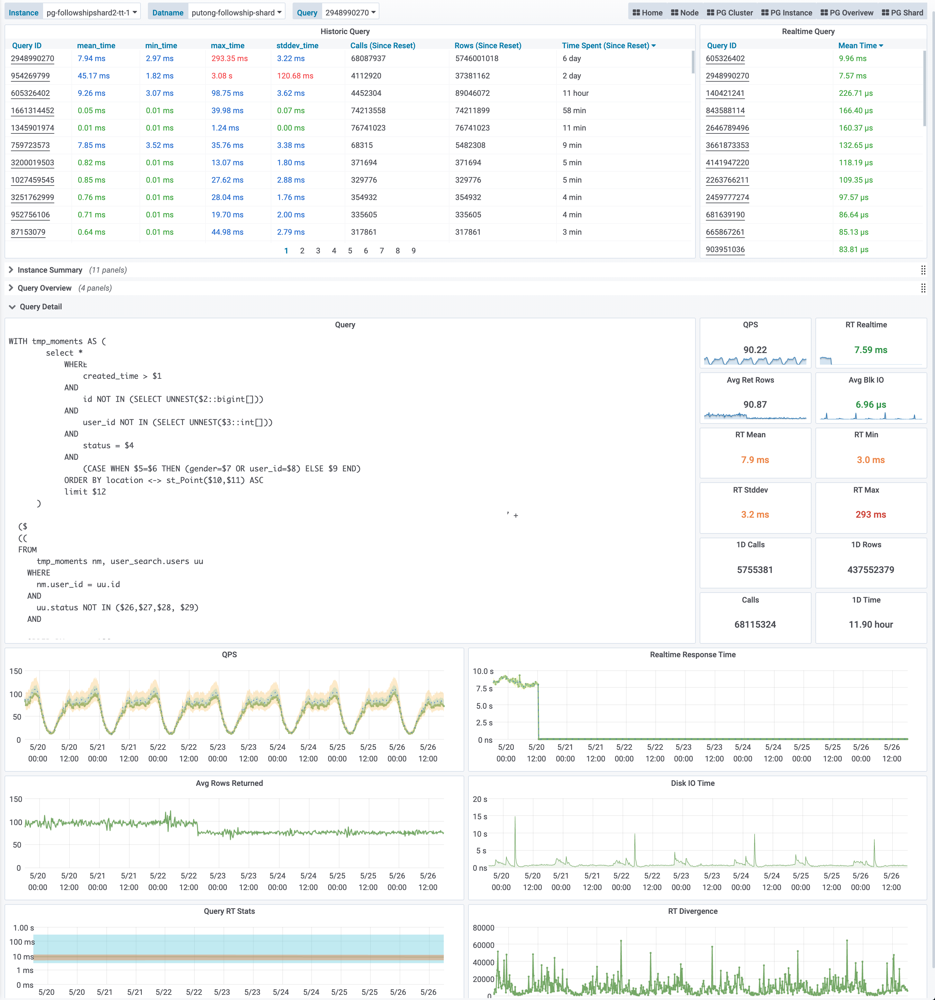

